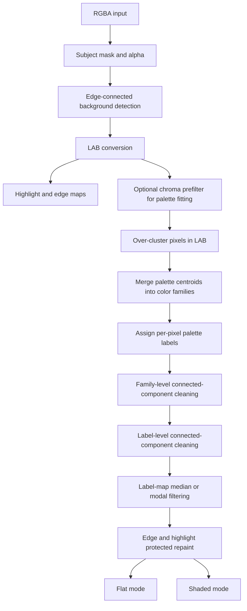
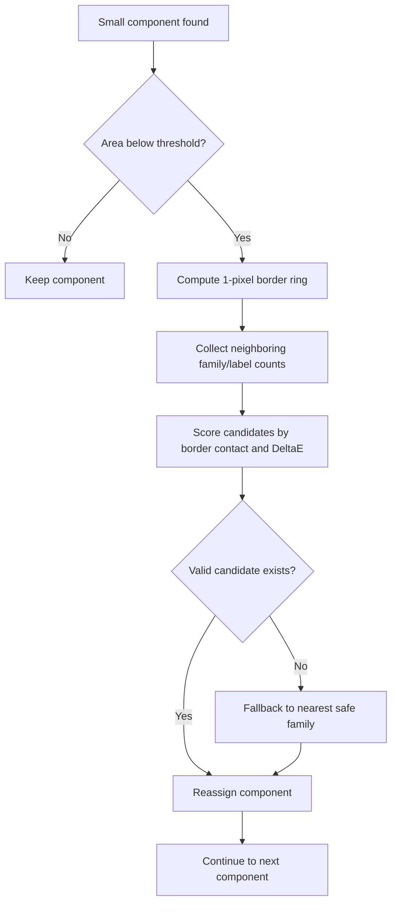

# Pixel Color Stabler Deep Research Report

## Executive summary

The current `Pixel_color_stabler` repository already contains the right *core idea* for SD-image cleanup: convert RGB to LAB, fit a small palette, assign each pixel to the nearest palette color, detect edge-connected bright background, clean tiny family and label islands, then remap the image with separate luma/chroma strengths and edge protection. The repository is split into a Tauri/Vite desktop app for the main offline UI path and an auxiliary Python package for CLI/API research and batch processing. The README explicitly describes the project as a lightweight tool for reducing noisy color blocks in AI-generated images by compressing colors toward a compact palette while preserving edges and luminance detail. citeturn41view0turn41view1turn20view4

The most important diagnosis is that the current baseline is still **color-only clustering with no spatial term during palette assignment**. The Python path fits a LAB palette from sampled pixels and then labels every pixel by nearest palette center in LAB; the TypeScript path does the same with a custom sampled k-means loop. Small dirty islands therefore appear whenever neighboring pixels land on different color centroids, especially in SD images that already contain high-frequency chroma noise. Higher `k` increases the number of decision boundaries, while higher `strength` and `chroma_strength` make those label mistakes more visible because reassigned pixels are pulled harder toward their target palette colors. The current code does perform family-island cleaning, label-island cleaning, and a 3×3 majority smoothing step, but those steps happen **after** the hard color assignment, so they are corrective rather than preventive. citeturn23view0turn23view2turn25view3turn25view4turn13view0turn15view0

A concrete, implementable solution is to keep LAB as the main working space, but upgrade the pipeline to a **two-level label system**: first over-cluster into palette labels, then merge palette labels into color families with explicit LAB/HSV rules and centroid-distance rules, then clean connected components in family space and label space separately, then apply a **label-map median or mode filter** instead of RGB blur, and finally render in either a **flat** mode or a **shaded** mode. For single-image SD cleanup, the best cost/performance choice is usually **MiniBatchKMeans in LAB** for palette fitting, **hierarchical or rule-based centroid merging** for families, **connected-component cleanup with image-size-scaled area thresholds**, and **border-majority reassignment** weighted by contact length and centroid distance. Mean-shift is best reserved for offline “auto-k” experiments because it is more bandwidth-sensitive and slower. citeturn32search3turn32search10turn37view2turn36search0turn37view5turn37view6turn34search1turn34search17

The repository is already close enough that this can be implemented as an incremental extension rather than a rewrite. In practice, I would prioritize these upgrades in this order: **spatially safer family merging**, **stronger component cleanup and border-majority refill**, **label-space median/modal filtering**, **highlight/background protection**, and then an optional **SLIC-guided quality tier** for difficult images. That ordering matches both the repo’s existing design and the “dirty island removal” direction already outlined in `dirty_pixel_solution.md`, while making the result much more robust on examples like the strawberry images. citeturn30view2turn30view3turn30view4turn30view8turn41view0

## Repository analysis

### Repository structure and current product paths

The repository currently exposes two product paths. The README states that the desktop app is the main product path and the Python package is an auxiliary research and batch-processing path. The desktop path is a Tauri + Vite UI, while the Python package provides a CLI/API core. The README also notes that optional OpenCV/scikit engines and SLIC-guided remapping are *planned* quality-tier enhancements, not the baseline implementation today. citeturn41view0turn41view1turn41view2

The most important source files, based on the repository tree and the files inspected in the latest branch, are summarized below. This map is synthesized from the repo tree, README, TypeScript source, Python source, and tests. citeturn17view0turn41view0turn10view1turn19view0turn21view0turn27view1

| Area | File | Current role |
|---|---|---|
| Desktop core | `src/labPalette.ts` | Main LAB pipeline in TS: LAB conversion, palette fitting, label assignment, family cleaning, label cleaning, smoothing, edge-aware remap |
| Desktop config | `src/appConfig.ts` | UI defaults in 0–100 scale |
| Desktop types | `src/types.ts` | Processing settings and result types |
| Python public API | `src/pixel_color_stabler/__init__.py` | Exposes `StabilizeConfig`, `stabilize_image`, `stabilize_batch` |
| Python config | `src/pixel_color_stabler/config.py` | Normalized dataclass config in 0–1 scale plus `dirty_clean`, `island_area`, EMA options |
| Python pipeline | `src/pixel_color_stabler/pipeline.py` | Main image path: load RGBA, mask, LAB, background detection, palette fit, label cleaning, edge-aware remap |
| Python palette | `src/pixel_color_stabler/palette.py` | Palette fitting, nearest-label assignment, EMA palette stabilization, greedy palette matching |
| Python edges | `src/pixel_color_stabler/edges.py` | Edge-strength estimation from L channel |
| Python prefilter | `src/pixel_color_stabler/prefilter.py` | 3×3 box smoothing on LAB chroma channels |
| Python metrics | `src/pixel_color_stabler/metrics.py` | Mean ΔE76 and low-gradient chroma variance |
| Tests | `tests/test_config.py`, `tests/test_palette_pipeline.py` | Basic pytest coverage for config normalization, alpha preservation, masking, dirty-island repaint, palette ordering |

### Key functions and parameters in the current code

The desktop UI defaults are `strength=80`, `paletteSize=6`, `lumaStrength=30`, `chromaStrength=90`, and `edgeProtect=70` in `src/appConfig.ts`, while the Python `StabilizeConfig` defaults to the normalized equivalents `k=6`, `strength=0.8`, `luma_strength=0.3`, `chroma_strength=0.9`, `edge_protect=0.7`, `max_samples=50_000`, `prefilter="chroma"`, `dirty_clean=True`, and `island_area=260`. The CLI mirrors the core palette and remap controls, including `--k`, `--strength`, `--luma-strength`, `--chroma-strength`, `--edge-protect`, `--max-samples`, `--mask`, `--stabilize`, `--reference`, `--palette-ema`, and `--prefilter`. That means the repository already has both a lightweight desktop baseline and a more tunable Python research path. citeturn10view8turn10view9turn21view0turn19view9

In the Python path, `stabilize_image_with_palette()` loads RGBA, extracts alpha, optionally applies an external mask, converts RGB to LAB, computes an edge-connected background mask, builds the process mask, optionally smooths chroma for palette fitting, fits a palette, assigns nearest palette labels, optionally runs dirty cleaning, computes edge strength from the L channel, and then remaps LAB toward the target palette using separate luma and chroma alphas before converting back to RGBA. The TypeScript path follows the same structure. citeturn25view3turn19view4turn20view0turn14view0turn14view1turn14view2

The current palette fit is a **manual sampled k-means** implementation, not scikit-learn KMeans. In TypeScript, the file defines `MAX_SAMPLES=50_000`, `KMEANS_ITERATIONS=18`, `BASE_DIRTY_ISLAND_AREA=260`, and `BASE_AREA_PIXELS=512*512`. In Python, `fit_palette_lab()` samples up to `max_samples`, initializes centers with a k-means++-style seeding routine, iterates until convergence or `max_iter`, and uses squared Euclidean LAB distance for nearest-center assignment. This is fast and deterministic, but it does not include any spatial regularization. citeturn15view0turn15view1turn23view0turn23view2turn24view0

The current “dirty island” cleanup is already two-stage. First, the code classifies palette colors into coarse families using LAB thresholds. In both TS and Python, bright low-chroma colors become a highlight family, green-like colors map to a green family, positive-a colors map to a red family, and very low-chroma colors map to a neutral family. Then `_clean_dirty_family_islands()` removes small family-connected components by reassigning them to the majority label on their border outside the family; after that `_clean_dirty_label_islands()` does the same in exact label space; after that `_smooth_label_map()` applies a 3×3 majority smoothing rule with a threshold of at least 5 supporting neighbors. citeturn12view4turn26view0turn26view1turn12view3turn11view3

Background detection is also already stronger than a naïve full-frame approach. The code treats fully transparent pixels as background and also floods from the border over pixels that are “background-like” in LAB, defined as very bright and near-neutral: `L > 92`, `|a| < 5.5`, `|b| < 7`. That is a good starting point for separating white paper-like backgrounds from internal highlights, but it is still intentionally simple and can miss non-white or softly colored backgrounds common in SD images. citeturn12view1turn12view2turn12view3turn22view0turn20view3

The repository does have tests, so it does **not** lack all test coverage. The Python tests check LAB round-tripping shape/dtype, requested palette size, alpha preservation, masked-out regions remaining unchanged, dirty-island recoloring on a synthetic example, and palette order matching. What the repo does *not* appear to have yet is a larger visual regression suite, a curated SD benchmark set, or a parameter-sweep evaluation harness. citeturn27view1turn29view2turn29view3

## Why dirty islands grow with stronger settings

The first root cause is architectural: the current assignment step is a **hard nearest-palette decision in pure color space**. In Python, `nearest_palette_indices()` reshapes LAB pixels to an `N×3` array and assigns each pixel to the palette center with minimum squared LAB distance. The current desktop path does the same conceptually with `assignPaletteLabels()`. There is no spatial coordinate, neighborhood prior, superpixel constraint, or structured regularizer in this step. In SD images, where adjacent pixels often fluctuate in chroma even on otherwise smooth surfaces, that means tiny local color variations can land on different centroids and form small disconnected label islands. citeturn19view7turn10view5turn25view3

The second root cause is that **higher palette counts usually increase label fragmentation**. scikit-learn’s KMeans documentation notes that k-means minimizes within-cluster variance and has average complexity \(O(k n T)\), while Celebi’s color-quantization paper emphasizes that k-means effectiveness depends strongly on initialization and implementation details. In this repo, increasing `k` means more palette cells and therefore more local decision boundaries through noisy color neighborhoods. That can preserve more nuance, but it also creates more opportunities for one- to few-pixel islands inside a broader red, green, or highlight region. citeturn37view0turn37view1turn34search0turn23view0

The third root cause is visibility rather than topology: **high `strength` and especially high `chroma_strength` make label errors look much dirtier**. After labeling, the repo pushes LAB values toward the target palette with separate luma and chroma alphas. For pixels the island cleaner marks as dirty, the code enforces a floor on the remap amount: luma is at least `strength * 0.65`, and chroma is at least `strength`. So once a noisy pixel gets placed in a wrong label, larger `strength` and `chroma_strength` do not merely preserve the error—they amplify it visually by driving it closer to an alien centroid. That is a major reason a single green pixel in a red area becomes a very conspicuous green block. citeturn14view0turn14view1turn14view2turn20view1

A more subtle cause is that the current Python prefilter smooths only the **palette-fitting source**, not the final per-pixel assignment source. `smooth_chroma()` applies a simple 3×3 box filter to the `a` and `b` channels before palette fitting, but labels are still assigned from the original `lab`, not the smoothed `palette_source`. This can stabilize centroid locations without fully suppressing pixel-scale chroma outliers at assignment time. In other words, the palette becomes slightly cleaner, but the noisy pixels still get the last word when selecting labels. citeturn19view4turn25view1turn25view3

High `edge_protect` can also leave more visible residue along boundaries. The remap uses `protection = 1 - edge_protect * edges` for non-dirty pixels, where edge strength is computed from the L channel using a Sobel-like gradient operator. That is good for preserving contours, but if a noisy pixel near an edge is *not* detected as part of a small island, then larger `edge_protect` suppresses correction there. The effect is desirable on true boundaries and undesirable on false chroma chatter near textured or specular regions. citeturn24view3turn25view4turn14view0

The current family logic helps, but it is intentionally coarse. A red family, green family, highlight family, neutral family, and “other” family are a good heuristic scaffold, yet they are not enough on their own for SD images with pink-red flesh, orange-red bounce light, white highlights, gray highlights, green edge contamination, and soft background bleed all in the same 512×512 image. That is why stronger output settings can look worse unless there is stronger spatial cleaning and better family merging upstream. citeturn12view4turn25view6turn30view3

## Concrete solution architecture

### Recommended end-to-end pipeline

The repo’s own `dirty_pixel_solution.md` already points toward the correct direction—background protection, LAB clustering, merging labels into broader “families,” connected-component cleanup, label-map smoothing, and separate flat/shaded rendering. The implementable pipeline below makes that direction concrete and aligns it with the existing Python and TS code paths. citeturn30view2turn30view3turn30view4turn30view8



### Color-space choice

**Use LAB as the main optimization space.** The repository already does this, and the choice is correct because LAB separates lightness from chromatic components, which makes it easier to control “same hue, different brightness” behavior with separate luma/chroma strengths. That is also why SLIC and related superpixel methods are commonly recommended in LAB rather than RGB; scikit-image’s segmentation docs explicitly note that SLIC works best in LAB. citeturn14view3turn40view0turn37view7

**Use HSV as a secondary rule space, not the primary clustering space.** HSV is helpful for family heuristics because hue bands are intuitive for category rules like red/green/background-sky/skin, but HSV is less stable near low saturation and has precision caveats in conversion. In practice, I recommend clustering in LAB and using HSV only to refine family merging rules or to split ambiguous “other” centroids. citeturn40view1

A robust family merge order is:

1. Detect background candidates outside the subject.
2. Detect highlight candidates inside the subject.
3. Fit palette labels in LAB.
4. Merge labels into families using LAB distance, chroma, and hue.
5. Clean in family space before exact label space.

### Clustering strategy

For this workload, I recommend the following policy:

| Strategy | Use case | Accuracy on dirty islands | Speed | Complexity | Important params | Recommendation |
|---|---|---:|---:|---:|---|---|
| KMeans | Small images, deterministic experiments | High | Medium | Medium | `k`, `init`, `n_init`, `max_iter` | Good baseline |
| MiniBatchKMeans | Default for production and batches | High-minus | High | Medium | `k`, `batch_size`, `init_size`, `max_no_improvement` | **Recommended default** |
| Agglomerative clustering | Merge palette centroids into families | High for family refinement | High on centroid count | Medium | `linkage`, `distance_threshold` | **Recommended for centroid merge only** |
| MeanShift | Offline auto-k mode | Medium-high | Low | Higher | `bandwidth`, `bin_seeding` | Optional analysis mode |
| SLIC-guided clustering | Hard cases with boundary chatter | Very high | Medium | Higher | `n_segments`, `compactness` | Optional quality tier |

This trade-off table combines repo constraints with the official scikit-learn clustering docs and the cited clustering literature. KMeans is fast but sensitive to initialization and local minima; MiniBatchKMeans trades a small amount of fidelity for much better scaling on large sample sets; AgglomerativeClustering is well suited to *merging a small number of palette centroids*; MeanShift is nonparametric but bandwidth-sensitive; and SLIC provides a practical spatial regularizer in LAB. citeturn37view0turn37view1turn37view2turn37view3turn37view4turn37view5turn37view6turn34search0turn34search1turn34search18turn34search22

My recommendation is **over-cluster then merge**:

- Step one: fit `k0 = 8–12` LAB centroids with `MiniBatchKMeans`.
- Step two: merge centroids into `3–7` families using hierarchical clustering on centroid LAB values plus family rules.
- Step three: clean connected components in family space, then optionally re-split into palette labels for shaded rendering.

That structure is more stable than directly fitting a tiny palette such as `k=4` to a noisy SD image.

### Family merging rules

Use explicit family rules on centroids, not on raw pixels. A centroid-level rule system is compact, fast, and easy to debug. A practical rule set is:

- **Background family**
  - alpha outside subject or edge-connected flood-fill from borders
  - or LAB very bright and low-chroma, with tolerance optionally widened by local edge weakness
- **Highlight family**
  - inside subject
  - `L >= 80` and chroma small
  - optionally keep only if it is attached to bright subject regions, not border background
- **Red family**
  - positive `a`, moderate or high chroma
  - HSV hue fallback: around red/orange band if saturation is not tiny
- **Green family**
  - negative `a` and positive `b`
- **Neutral family**
  - low chroma but not bright enough for highlight
- **Other family**
  - everything else

Then perform **centroid merging** with rules such as:

- merge two centroids if `ΔE00 < 10–14`
- or if hue difference is below `8–12°` and lightness difference below `14`
- but do **not** merge background with highlight unless one component is tiny and fully enclosed by the other
- do **not** merge specular highlight centroids into neutral gray if they are among the top `5%` pixels in L

That step prevents “one red family split into many tiny palette labels” from turning into visible dirty islands later.

### Connected-component cleaning and border-majority reassignment

Connected-component cleaning is the most direct fix for the strawberry-style artifacts. OpenCV’s `connectedComponentsWithStats` gives a component label map plus per-component area via `CC_STAT_AREA`, which is exactly what this problem needs. The repo already scales island thresholds by image size relative to `512×512`; keep that, but split it into **three thresholds** instead of one:

- `speck_area`: ultra-small components, e.g. 16–40 pixels at 512²
- `label_area`: small exact-label islands, e.g. 48–120 pixels at 512²
- `family_area`: cross-family islands, e.g. 180–320 pixels at 512²

Scale all three by:

```python
scale = (H * W) / (512 * 512)
thr = round(base_thr * scale)
```

That scaling principle is already consistent with the repo’s current `island_area` handling and with the author’s own dirty-island design note. citeturn15view5turn15view6turn11view3turn30view7turn30view8turn35view0turn38view4

The crucial improvement I recommend is **border-majority reassignment**, not simple “fill with nearest mean.” For each small component:

- dilate the component by one pixel
- subtract the component itself to get a border ring
- count neighbor family/label frequencies on the ring
- weight each candidate by both border contact length and color compatibility
- reassign the whole component to the best candidate

That is more stable than global nearest-color refill and less likely to leak a wrong family across a narrow edge.



### Label-map median filtering versus RGB blurring

This distinction is essential.

The current repo already smooths the **label map**, not the RGB image, via a 3×3 majority operation. Keep that philosophy and strengthen it. A label-space median or modal filter is preferable because it preserves the discrete palette/family vocabulary; it cannot invent new colors. By contrast, RGB blurs—box, Gaussian, or even bilateral filtering—operate directly in color space and can create intermediate colors or soften highlight boundaries. OpenCV’s bilateral filter is valuable as a prefilter because it can reduce noise while keeping edges relatively sharp, but the docs also note that it is slow and that large sigma values can create a cartoonish effect. Therefore: use RGB/LAB filtering only *before clustering* or for controlled shading reconstruction, and do final cleanup in label space. citeturn38view2turn38view3turn25view1turn26view1

In practice:

- for palette fitting: optional bilateral or AB-only smoothing
- for topology cleanup: label-map median/modal filter
- for final output: no RGB blur in flat mode; very limited guided smoothing in shaded mode only

### Edge handling, highlight preservation, and background detection

The repo already computes edge strength from the L channel and attenuates remapping near edges, while excluding edge-connected bright-neutral background from processing. That is the correct baseline. The next improvement is to separate three masks:

- `bg_mask`: edge-connected background
- `hi_mask`: internal specular highlights
- `edge_mask`: medium/high gradients

Then use different cleanup policies:

- never let `bg_mask` vote into subject labels unless the component actually touches the image border
- allow `hi_mask` to survive family cleaning more easily than ordinary neutral specks
- reduce median/modal filtering on strong `edge_mask`
- in shaded mode, preserve original L on highlights more aggressively than on matte regions

This turns “bright internal white islands” from a nuisance into a protected visual feature.

### Two output modes

The repo notes “flat” and “shaded” as target modes in its design note, but the current baseline is effectively closer to shaded remapping because it linearly interpolates the original LAB toward a palette target with independent luma/chroma strengths. The production design should make both modes explicit. citeturn30view8turn14view2

**Flat mode**

- output one color per final family or per merged palette label
- zero or near-zero texture retention
- best for icons, stickers, sprites, UI assets

**Shaded mode**

- keep shape cues by preserving a controlled portion of original L
- strongly compress chroma but partially preserve luminance
- optionally quantize L into 2–4 steps inside each family for “clean stylized shading”
- best for SD illustrations that should stay painterly but cleaner

### Implementable Python snippets

The following snippets are designed to be implementable with OpenCV, NumPy, scikit-learn, scikit-image, and PIL. They are not lifted from the repo verbatim; they are a concrete extension plan for the current architecture.

#### Background and highlight masks

```python
from __future__ import annotations

import cv2
import numpy as np
from skimage.color import rgb2lab, rgb2hsv

def detect_bg_hi_masks(rgba: np.ndarray) -> tuple[np.ndarray, np.ndarray, np.ndarray]:
    """Return background, highlight, and edge masks.
    rgba: uint8 HxWx4
    """
    rgb = rgba[..., :3].astype(np.float32) / 255.0
    alpha = rgba[..., 3] > 0

    lab = rgb2lab(rgb)  # L in [0,100]
    hsv = rgb2hsv(rgb)

    L = lab[..., 0]
    a = lab[..., 1]
    b = lab[..., 2]
    chroma = np.sqrt(a * a + b * b)

    # Edge-connected bright/neutral background seed.
    bg_seed = alpha & (L > 92) & (np.abs(a) < 6) & (np.abs(b) < 8)

    # Flood-fill from border over seed mask.
    h, w = bg_seed.shape
    bg = np.zeros_like(bg_seed, dtype=np.uint8)
    q = []

    def enqueue(y: int, x: int) -> None:
        if 0 <= y < h and 0 <= x < w and bg_seed[y, x] and not bg[y, x]:
            bg[y, x] = 1
            q.append((y, x))

    for x in range(w):
        enqueue(0, x)
        enqueue(h - 1, x)
    for y in range(h):
        enqueue(y, 0)
        enqueue(y, w - 1)

    k = 0
    while k < len(q):
        y, x = q[k]
        k += 1
        enqueue(y - 1, x)
        enqueue(y + 1, x)
        enqueue(y, x - 1)
        enqueue(y, x + 1)

    bg_mask = bg.astype(bool)

    # Internal highlight candidates: bright, low-chroma, not background.
    hi_mask = alpha & (~bg_mask) & (L > 78) & (chroma < 18)

    # L-channel edge map.
    L8 = np.clip(L * 255.0 / 100.0, 0, 255).astype(np.uint8)
    gx = cv2.Sobel(L8, cv2.CV_32F, 1, 0, ksize=3)
    gy = cv2.Sobel(L8, cv2.CV_32F, 0, 1, ksize=3)
    edge = cv2.magnitude(gx, gy)
    edge = edge / (edge.max() + 1e-6)

    return bg_mask, hi_mask, edge
```

#### Palette fitting and family merge

```python
from sklearn.cluster import MiniBatchKMeans, AgglomerativeClustering
from skimage.color import rgb2lab, rgb2hsv

def fit_palette_lab_mbk(
    rgb_u8: np.ndarray,
    process_mask: np.ndarray,
    k0: int = 10,
    random_state: int = 0,
) -> tuple[np.ndarray, np.ndarray]:
    """Return palette_lab and per-pixel labels."""
    rgb = rgb_u8.astype(np.float32) / 255.0
    lab = rgb2lab(rgb).astype(np.float32)
    flat = lab.reshape(-1, 3)
    mask_flat = process_mask.reshape(-1)

    X = flat[mask_flat]
    km = MiniBatchKMeans(
        n_clusters=k0,
        init="k-means++",
        batch_size=4096,
        init_size=max(3 * k0, 1024),
        n_init="auto",
        max_no_improvement=10,
        random_state=random_state,
    )
    km.fit(X)

    palette = km.cluster_centers_.astype(np.float32)

    # Assign all process pixels.
    d2 = ((flat[:, None, :] - palette[None, :, :]) ** 2).sum(axis=2)
    labels = np.argmin(d2, axis=1).reshape(lab.shape[:2])

    return palette, labels

def merge_palette_to_families(
    palette_lab: np.ndarray,
    palette_rgb_u8: np.ndarray | None = None,
    delta_thresh: float = 12.0,
) -> np.ndarray:
    """Return family id per palette centroid."""
    a = palette_lab[:, 1]
    b = palette_lab[:, 2]
    L = palette_lab[:, 0]
    chroma = np.sqrt(a * a + b * b)

    # Seed family tags.
    fam = np.full(len(palette_lab), -1, dtype=np.int32)
    fam[(L > 80) & (chroma < 18)] = 3   # highlight
    fam[(a < -7) & (b > 0)] = 2         # green
    fam[(a > 10) & (b > -5)] = 1        # red
    fam[(chroma < 14) & (fam < 0)] = 4  # neutral
    fam[fam < 0] = 0                    # other

    # Optional hierarchical merge within each seeded family.
    out = fam.copy()
    next_id = 10
    for seed in np.unique(fam):
        idx = np.where(fam == seed)[0]
        if len(idx) <= 1:
            out[idx] = next_id
            next_id += 1
            continue

        X = palette_lab[idx]
        agg = AgglomerativeClustering(
            n_clusters=None,
            distance_threshold=delta_thresh,
            linkage="average",
            metric="euclidean",
        )
        sub = agg.fit_predict(X)
        for s in np.unique(sub):
            out[idx[sub == s]] = next_id
            next_id += 1

    return out
```

#### Connected-component cleanup with border-majority reassign

```python
import cv2
import numpy as np

def clean_small_components(
    label_map: np.ndarray,
    process_mask: np.ndarray,
    base_area: int,
    base_ref: tuple[int, int] = (512, 512),
    comp_to_family: np.ndarray | None = None,
    palette_lab: np.ndarray | None = None,
) -> np.ndarray:
    """
    Remove small islands via border-majority reassignment.
    If comp_to_family is given, cleanup is done in family space.
    """
    h, w = label_map.shape
    scale = (h * w) / float(base_ref[0] * base_ref[1])
    min_area = max(2, int(round(base_area * scale)))

    active = process_mask.astype(bool)
    work = label_map.copy()

    # Process one class/family at a time for stability.
    for current_id in np.unique(work[active]):
        mask = (work == current_id) & active
        num, cc, stats, _ = cv2.connectedComponentsWithStats(mask.astype(np.uint8), connectivity=8)

        for comp_id in range(1, num):
            area = int(stats[comp_id, cv2.CC_STAT_AREA])
            if area >= min_area:
                continue

            component = (cc == comp_id)

            # Border ring.
            dil = cv2.dilate(component.astype(np.uint8), np.ones((3, 3), np.uint8), iterations=1).astype(bool)
            ring = dil & (~component) & active

            neigh = work[ring]
            if neigh.size == 0:
                continue

            # If cleaning in family space, prefer candidates from surrounding dominant family.
            ids, counts = np.unique(neigh, return_counts=True)
            score = counts.astype(np.float32)

            if palette_lab is not None:
                src_pixels = palette_lab[work[component]]
                src_mean = src_pixels.mean(axis=0)
                cand_means = np.array([palette_lab[i] for i in ids], dtype=np.float32)
                d = np.sqrt(((cand_means - src_mean[None, :]) ** 2).sum(axis=1))
                score = score / (1.0 + d)

            best = ids[np.argmax(score)]
            work[component] = best

    return work
```

#### Flat and shaded rendering

```python
from skimage.color import rgb2lab, lab2rgb

def render_flat(rgb_u8: np.ndarray, family_map: np.ndarray, family_lab: np.ndarray) -> np.ndarray:
    """One clean color per family."""
    out_lab = family_lab[family_map]
    out_rgb = np.clip(lab2rgb(out_lab) * 255.0, 0, 255).astype(np.uint8)
    return out_rgb

def render_shaded(
    rgb_u8: np.ndarray,
    label_map: np.ndarray,
    palette_lab: np.ndarray,
    edge_mask: np.ndarray,
    hi_mask: np.ndarray,
    strength: float = 0.80,
    luma_strength: float = 0.25,
    chroma_strength: float = 0.90,
    edge_protect: float = 0.70,
) -> np.ndarray:
    """Preserve shading while compressing chroma."""
    lab = rgb2lab(rgb_u8.astype(np.float32) / 255.0).astype(np.float32)
    tgt = palette_lab[label_map]

    protection = 1.0 - edge_protect * edge_mask
    protection = np.clip(protection, 0.0, 1.0)

    # Preserve highlight luminance more.
    l_alpha = strength * luma_strength * protection
    l_alpha = np.where(hi_mask, 0.35 * l_alpha, l_alpha)
    ab_alpha = strength * chroma_strength * protection

    out = lab.copy()
    out[..., 0] = lab[..., 0] * (1 - l_alpha) + tgt[..., 0] * l_alpha
    out[..., 1] = lab[..., 1] * (1 - ab_alpha) + tgt[..., 1] * ab_alpha
    out[..., 2] = lab[..., 2] * (1 - ab_alpha) + tgt[..., 2] * ab_alpha

    return np.clip(lab2rgb(out) * 255.0, 0, 255).astype(np.uint8)
```

## Method comparison and recommended presets

### Prioritized algorithmic improvements

The following priorities are the best balance between implementation effort and visual payoff for this repository. They are ranked for *this* project, not in the abstract. The ranking is based on the current repo architecture, its existing defaults, the official clustering/filtering docs, and the color-quantization / mean-shift / SLIC literature. citeturn41view0turn21view0turn37view0turn37view2turn34search0turn34search1turn34search22

| Priority | Improvement | Why it matters now | Implementation effort | Expected payoff |
|---|---|---|---:|---:|
| Highest | Over-cluster + family merge + two-stage component cleanup | Prevents cross-color islands before they become highly visible | Medium | Very high |
| High | Border-majority reassignment weighted by border contact and ΔE | Replaces dirty islands with locally plausible colors | Low-medium | Very high |
| High | Label-map median/modal filtering | Removes residual one-pixel chatter without inventing colors | Low | High |
| High | Separate highlight/background masks | Prevents white background and subject highlight contamination | Low-medium | High |
| Medium | MiniBatchKMeans default engine | Better scaling and simpler tuning for batches | Low | Medium-high |
| Medium | Hierarchical merge on centroids | More stable family grouping than raw threshold rules alone | Low-medium | Medium-high |
| Medium | Flat vs shaded explicit output renderer | Makes the tool useful for both icons and painterly SD art | Low | Medium-high |
| Optional | SLIC-guided label stabilization | Best quality on hard boundary chatter | Medium-high | High |
| Optional | MeanShift auto-k mode | Nice analysis tool, but harder to tune in production | Medium | Medium |

### Recommended default presets

These presets are scaled around a `512×512` reference image because the repo already uses that normalization for `island_area`, and the design note in `dirty_pixel_solution.md` also recommends scaling thresholds by image size. citeturn15view5turn15view6turn30view7

| Preset | Output mode | Over-cluster `k0` | Final families/labels | `strength` | `luma_strength` | `chroma_strength` | `edge_protect` | `speck_area` @512² | `label_area` @512² | `family_area` @512² | Label median |
|---|---|---:|---:|---:|---:|---:|---:|---:|---:|---:|---:|
| `sd_soft_shaded` | shaded | 8 | 5–7 | 0.75 | 0.22 | 0.82 | 0.70 | 20 | 56 | 180 | 3 |
| `sd_default_shaded` | shaded | 10 | 5–7 | 0.80 | 0.25 | 0.88 | 0.70 | 24 | 72 | 260 | 3 |
| `sd_strong_shaded` | shaded | 10 | 4–6 | 0.88 | 0.20 | 0.93 | 0.65 | 28 | 96 | 320 | 5 |
| `icon_flat` | flat | 6 | 3–5 | 1.00 | 0.05 | 1.00 | 0.85 | 16 | 64 | 260 | 5 |
| `poster_flat_clean` | flat | 7 | 4–6 | 0.95 | 0.08 | 0.96 | 0.80 | 20 | 80 | 300 | 5 |

Use size scaling as:

```python
scale = (H * W) / (512 * 512)
speck_area  = round(base_speck_area  * scale)
label_area  = round(base_label_area  * scale)
family_area = round(base_family_area * scale)
```

These presets intentionally keep `k0` moderately higher than the final family count, because over-cluster-then-merge is more stable for dirty-island removal than fitting a tiny palette immediately.

### Accuracy, speed, and parameter comparison of candidate methods

The current repo baseline is already a strong lightweight start, but the candidate methods below make clear where to spend engineering effort. This table is an engineering synthesis grounded in the repo code, the official scikit-learn and OpenCV docs, and the cited clustering/segmentation papers. citeturn41view0turn23view0turn37view0turn37view2turn37view5turn38view2turn34search0turn34search1turn34search22

| Method | Dirty-island accuracy | Speed | Complexity | Main params | Best use |
|---|---:|---:|---:|---|---|
| Current repo baseline | Medium | High | Low | `k`, strengths, `edge_protect`, `island_area` | Lightweight baseline |
| MiniBatchKMeans + family merge + CC clean | High | High | Medium | `k0`, merge threshold, area thresholds | **Recommended default** |
| KMeans + family merge + CC clean | High | Medium | Medium | `k0`, `n_init`, `max_iter` | Small image research mode |
| MiniBatchKMeans + SLIC-guided cleanup | Very high | Medium | Medium-high | `n_segments`, `compactness`, area thresholds | Hard SD cases |
| MeanShift + CC clean | Medium-high | Low | Higher | `bandwidth`, `bin_seeding` | Offline auto-k exploration |
| Pure RGB bilateral / blur cleanup | Low-medium | Medium | Low | filter diameter, sigma | Not recommended as main cleaner |

The reason “pure RGB blur cleanup” ranks poorly is not that bilateral filtering is useless—OpenCV explicitly notes it is good at reducing noise while keeping edges relatively sharp—but because blur-based cleanup acts in color space instead of label topology. For SD dirty islands, topology is the real problem. citeturn38view2turn38view3

## Experimental plan and evaluation metrics

### Experimental plan

The repository already includes basic functional tests, but it still needs a validation plan that reflects the actual target use case: SD-generated images with cross-color dirty islands, noisy highlights, and posterized chroma chatter. The plan below is the fastest route to trustworthy defaults. citeturn27view1turn29view2

First, assemble a benchmark set with at least three buckets:

- **Simple subjects**: fruit, faces, flowers, single objects on clean backgrounds
- **Difficult specular subjects**: shiny fruit, glass, metal, wet surfaces, glossy anime eyes
- **Busy backgrounds**: scenes where edge-connected background detection can fail

A practical first pass is 50–100 images, with 10–20 manually annotated family masks for more rigorous evaluation.

Second, define the ablations:

1. Current repo baseline
2. Baseline + improved background/highlight masks
3. Baseline + MiniBatchKMeans over-clustering
4. Baseline + family merge
5. Baseline + family CC cleaning
6. Baseline + label CC cleaning
7. Baseline + label median/modal filtering
8. Baseline + flat/shaded split
9. Optional SLIC-guided version

Third, run parameter sweeps around the recommended presets using image-size scaling. The most important sweep axes are `k0`, family merge threshold, `family_area`, `label_area`, label median kernel, and `edge_protect`.

Fourth, perform visual review in a grid with at least these side-by-side panels:

- original
- current repo baseline
- proposed default shaded
- proposed strong shaded
- proposed flat
- optional SLIC quality tier

Fifth, lock defaults only after both quantitative metrics and visual review agree. Dirty-island cleanup is one of those problems where a single metric is never enough.

### Recommended metrics

The repo already includes two useful quantitative helpers: mean ΔE76 and low-gradient chroma variance. Keep those, then add segmentation-oriented and perceptual metrics around them. The evaluation stack below uses repo-native metrics plus standard image quality metrics from scikit-image and the perceptual-metric literature. citeturn31view2turn34search3turn34search7turn42search0turn42search2turn42search1turn42search17

| Metric | Type | What it measures | Better direction |
|---|---|---|---:|
| Family IoU | Quantitative segmentation | Overlap between predicted family masks and manual family annotations | Higher |
| Small-component ratio | Structural cleanup | Percent of subject pixels belonging to components below threshold | Lower |
| Low-gradient chroma variance | Quantitative smoothness | Chroma noise in flat/low-edge regions | Lower |
| Mean ΔE76 to source | Color distortion | Overall perceptual color drift from source | Lower, but not too low at expense of cleanup |
| SSIM | Structural fidelity | Preservation of overall image structure | Higher |
| LPIPS | Perceptual similarity | Deep perceptual distance to source | Lower |
| DISTS | Perceptual structure + texture | Perceptual quality with some texture tolerance | Lower |
| Highlight retention score | Task-specific | Percent of internal highlight mask retained after cleanup | Higher |

A good evaluation rule is:

- Optimize **small-component ratio** and **low-gradient chroma variance** first for cleanup quality.
- Use **family IoU** to ensure cleanup is semantically correct.
- Use **SSIM**, **LPIPS**, and **DISTS** to avoid over-cleaning into plastic or dead-looking surfaces.
- Track **mean ΔE76** so presets do not drift too far from the source palette.

Here is a minimal metric scaffold that fits the current Python package design:

```python
from __future__ import annotations

import numpy as np
from skimage.metrics import structural_similarity as ssim
from skimage.color import rgb2lab

def family_iou(pred: np.ndarray, gt: np.ndarray, family_id: int) -> float:
    p = pred == family_id
    g = gt == family_id
    inter = np.logical_and(p, g).sum()
    union = np.logical_or(p, g).sum()
    return float(inter / union) if union else 1.0

def small_component_ratio(label_map: np.ndarray, process_mask: np.ndarray, area_thr: int) -> float:
    import cv2
    total = int(process_mask.sum())
    if total == 0:
        return 0.0

    small = 0
    for lab_id in np.unique(label_map[process_mask]):
        mask = ((label_map == lab_id) & process_mask).astype(np.uint8)
        num, _, stats, _ = cv2.connectedComponentsWithStats(mask, connectivity=8)
        for i in range(1, num):
            area = int(stats[i, cv2.CC_STAT_AREA])
            if area < area_thr:
                small += area
    return small / total

def masked_mean_delta_e76(src_rgb: np.ndarray, out_rgb: np.ndarray, mask: np.ndarray) -> float:
    src = rgb2lab(src_rgb.astype(np.float32) / 255.0)
    out = rgb2lab(out_rgb.astype(np.float32) / 255.0)
    d = np.sqrt(((src - out) ** 2).sum(axis=-1))
    vals = d[mask]
    return float(vals.mean()) if vals.size else 0.0

def masked_ssim(src_rgb: np.ndarray, out_rgb: np.ndarray) -> float:
    # Simpler whole-image SSIM; for masked SSIM, crop to subject bbox first.
    return float(ssim(src_rgb, out_rgb, channel_axis=-1, data_range=255))
```

### Decision rule for selecting defaults

I recommend choosing defaults by a weighted score such as:

- `0.30 * normalized_family_iou`
- `0.25 * (1 - normalized_small_component_ratio)`
- `0.15 * (1 - normalized_low_gradient_chroma_variance)`
- `0.10 * normalized_ssim`
- `0.10 * (1 - normalized_lpips)`
- `0.10 * highlight_retention`

That weighting reflects the actual product goal stated by the repository and by the author’s own design note: **cleaner color families and removal of dirty islands**, not just maximum fidelity to the original noisy SD output. citeturn41view0turn30view8

## Final recommendation

The most practical path for `Pixel_color_stabler` is **not** to replace the current LAB-palette idea, but to make it spatially smarter. Concretely, I recommend implementing a new “cleaner” path in the Python core first, then porting the same logic to the TypeScript desktop path:

- keep LAB as the main working space
- optionally use HSV only for family rule refinement
- switch default palette fitting to `MiniBatchKMeans`
- over-cluster first, then merge centroids into families
- split cleanup thresholds into `speck_area`, `label_area`, and `family_area`
- use `connectedComponentsWithStats` for both family and label island removal
- reassign tiny components by weighted border-majority vote
- apply label-map median/modal filtering, not RGB blurring
- explicitly protect background and highlights
- provide two outputs: **flat** and **shaded**
- reserve SLIC-guided remapping as an optional quality tier for difficult images

That design is concrete, implementable with the requested Python/OpenCV/NumPy/scikit-learn/scikit-image/PIL stack, consistent with the repository’s latest code and documentation, and well matched to the exact failure mode seen in SD-generated strawberry-like examples: tiny cross-color islands that become visually ugly when strong color compression makes them more saturated and more uniform. citeturn41view0turn21view0turn25view3turn25view4turn30view2turn30view3turn30view4turn30view8