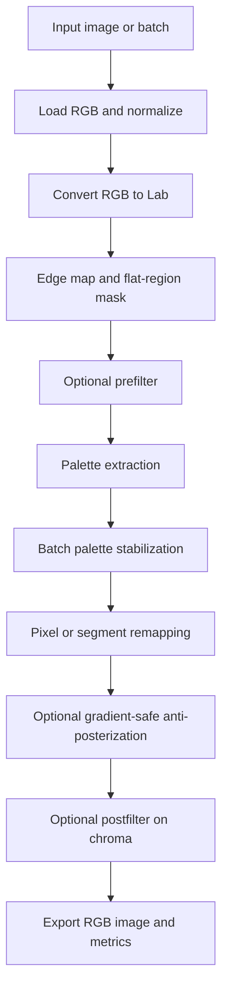

# Feasible Palette Compression Pipeline for Cleaning Stable Diffusion Color Noise

Representative visuals from official scikit-image galleries illustrate the kinds of operations that matter for this problem: histogram matching, denoising and posterization trade-offs, and superpixel segmentation. These are not Stable Diffusion examples, but they are good visual analogs for the effects discussed in this report. citeturn10view5turn28view1turn28view2turn17image2

iturn16image0turn16image2turn17image1turn17image2

## Executive summary

A feasible, implementable tool for reducing noisy color blocks in Stable Diffusion outputs is a **CPU-friendly, modular pipeline** built around five ideas: work in a perceptual color space such as **Lab**; optionally apply **edge-preserving smoothing** before palette extraction; estimate a compact palette with **MiniBatchKMeans** or a simpler palette quantizer; stabilize that palette across related images with **assignment-based centroid matching**; and remap colors with **edge-aware blending** so that edges and luminance detail survive even when chroma is aggressively compressed. These pieces are all available with lightweight Python building blocks: Pillow, OpenCV, scikit-image, NumPy, scikit-learn, and SciPy. citeturn14view1turn24search0turn8view7turn29view0turn7view5turn10view0

For the simplest baseline, **Pillow** already exposes palette quantization methods including **median cut**, **maximum coverage**, **fast octree**, and **libimagequant**. Pillow uses **median cut by default** except for RGBA images, where **fast octree** is used by default; it also exposes **no dithering** and **Floyd–Steinberg dithering**. That makes a very small, dependency-light baseline possible. The caveat is that Pillow’s standard wheels generally include most optional libraries **except libimagequant**, so that backend is often unavailable unless Pillow is built with additional support or you call `pngquant/libimagequant` externally. citeturn8view0turn8view6turn20view5turn7view11

For better visual control on SD-style artifacts, the best default is usually **Lab + moderate bilateral filtering + MiniBatchKMeans palette extraction + optional SLIC-guided remapping + mild anti-posterization blending**. MiniBatchKMeans is intended to reduce compute relative to full KMeans, and scikit-learn documents it as a faster large-scale alternative; SLIC is efficient, uses color and location jointly, and is explicitly recommended in Lab space; bilateral filtering is edge-preserving by construction. citeturn11search6turn11search11turn28view2turn10view0turn24search0turn8view7

## Problem framing

The design goal is to **compress the palette of an input image down to one or a few unified colors** while still preserving the parts of the image that make it look coherent: edges, shading, object boundaries, and visually important gradients. In this use case, the source images are **Stable Diffusion outputs that already exhibit undesirable blocky chroma noise**. The target behavior is not generic compression for file size; it is **perceptual cleanup** of chroma variation and over-fragmented color regions. That focus aligns better with perceptual color spaces, edge-aware smoothing, and region-aware remapping than with plain RGB quantization alone. citeturn14view1turn24search0turn28view0

The implementation constraints in your prompt are also practical: no fixed language or framework requirement, but with a strong preference for **lightweight Python implementations** centered on **PIL/Pillow, OpenCV, scikit-image, and NumPy**. Those libraries cover image I/O, color conversion, denoising, segmentation, palette conversion, and array manipulation directly. If an optional “speed tier” is needed later, OpenCV provides C++ implementations of the core image operations, and `libimagequant` has moved to a **pure Rust** codebase while remaining ABI-compatible for C consumers. citeturn20view1turn31search0turn21view1turn20view0

The evaluation metrics should reflect the actual trade-off surface. **Visual quality and structure preservation** can be tracked with **SSIM**; **perceptual deviation** can be tracked with **LPIPS**; **color fidelity** can be measured in **Lab** using **ΔE**, especially **CIEDE2000**; and **distributional color drift** can be summarized with **histogram-distance** measures via OpenCV’s histogram comparison APIs. LPIPS is useful but substantially heavier than the rest of the stack because the reference implementation depends on **PyTorch** and **torchvision**, so it belongs in evaluation, not in the real-time core pipeline. citeturn7view2turn7view3turn1search17turn15view3turn15view0

Artifact reduction is the one evaluation category that is partly **unspecified** in the literature for this exact SD-cleanup task. There is no single standard metric for “noisy color block cleanup,” so the most practical approach is to report a small set of **task-specific proxies** in addition to SSIM/LPIPS/ΔE: chroma variance in low-gradient regions, count of tiny isolated color islands after remapping, and edge preservation measured on a Sobel or Canny-derived edge mask. Those edge maps are easy to produce with scikit-image or OpenCV. citeturn31search6turn31search10turn31search1

## Algorithm options and trade-offs

The table below is a **qualitative engineering summary**. The ratings are not benchmark measurements; they are grounded in the cited papers and official docs plus the typical behavior of CPU implementations on moderate image sizes. citeturn7view1turn10view4turn10view3turn8view7turn28view2turn30view3

| Method | Quality | Speed | Memory | Best-use cases |
|---|---|---:|---:|---|
| KMeans in Lab | High | Medium | Medium | Controlled palette cleanup, few-color stylization |
| MiniBatchKMeans in Lab | High- | Fast | Low-Medium | Default Python implementation, batch processing |
| Median cut | Medium | Fast | Low | Tiny baseline, ≤256 colors, few dependencies |
| Fast octree | Medium-High | Fast | Low | RGBA, speed-first quantization |
| libimagequant | High | Fast | Low-Medium | Best palette aesthetics when available |
| Bilateral filter | Medium-High | Slow-Medium | Medium | Edge-preserving pre/post cleanup |
| Guided filter | High | Fast | Low-Medium | Edge-preserving smoothing with fewer artifacts |
| Mean-shift posterization | Medium-High | Slow | Medium | Flattening texture and gradients into regions |
| SLIC-guided remap | High | Medium | Medium | Region-consistent color cleanup |
| Quickshift / local mode seeking | High | Slow | Medium-High | Hierarchical, locally adaptive color regions |
| Histogram / color transfer | Medium | Fast | Low | Batch consistency, reference-driven palette normalization |

### Global palette quantization

#### KMeans and MiniBatchKMeans

**Description.** KMeans treats palette extraction as clustering in color space. In practice here, you cluster pixels in **Lab** rather than RGB so that distances are more aligned with perception, then replace each pixel with its assigned centroid. Scikit-learn documents classic KMeans with average complexity **O(k n T)**, where `k` is cluster count, `n` is sample count, and `T` is the number of iterations. Its docs also explicitly recommend **MiniBatchKMeans** as a faster alternative for large sample counts. citeturn7view1turn14view1turn11search11turn29view0

**Pros.** It is controllable, deterministic when seeded, easy to evaluate, and easy to extend with weights, downsampling, masking, or batch stabilization. It also works well for “one or a few unified colors” because reducing `k` is direct and interpretable. citeturn7view1turn29view0

**Cons.** Full KMeans is more expensive than tree-based quantizers, can get stuck in local minima, and can over-flatten gradients if hard-assignment is used naively. Scikit-learn’s own examples note that MiniBatchKMeans is faster but can produce slightly different results from full KMeans. citeturn7view1turn11search9

**Complexity.** For full KMeans, use scikit-learn’s average complexity **O(k n T)** as the working estimate. For MiniBatchKMeans, the practical cost is typically lower because training occurs on batches rather than the full dataset at each step. citeturn7view1turn29view0

**Recommended parameters.** For SD cleanup, good starting points are: `k=6` as a default, `k=3–4` for stronger flattening, `k=1–2` for near-monochrome stylization; sample at most `20k–80k` pixels from the image for fitting; use `MiniBatchKMeans(init="k-means++", batch_size=1024, max_iter=100, n_init="auto", random_state=0)`; operate in **Lab float32**. The exact `k` is **unspecified** and should remain user-adjustable. The scikit-learn defaults for `batch_size`, `max_iter`, and `n_init` are all documented. citeturn29view0turn14view1

```python
def quantize_kmeans_lab(rgb, k=6, max_samples=50000):
    lab = rgb2lab(rgb).astype(float32)
    X = lab.reshape(-1, 3)

    idx = sample_indices(len(X), max_samples, seed=0)
    model = MiniBatchKMeans(
        n_clusters=k,
        init="k-means++",
        batch_size=1024,
        max_iter=100,
        n_init="auto",
        random_state=0,
    )
    model.fit(X[idx])

    labels = model.predict(X)
    remapped = model.cluster_centers_[labels].reshape(lab.shape)
    return lab2rgb(remapped)
```

#### Median cut

**Description.** Heckbert’s median cut recursively splits color-space boxes so that each output box represents roughly an equal number of source pixels. The paper describes repeatedly subdividing the color space into smaller rectangular boxes, sorting enclosed points along the longest dimension, and splitting at the median. Pillow exposes median cut directly as `Quantize.MEDIANCUT`. citeturn10view4turn8view0turn7view10

**Pros.** Extremely compact implementation path, good baseline behavior, and available immediately in Pillow with no clustering dependency. citeturn8view0turn7view10

**Cons.** Less controllable than KMeans for perceptual cleanup, less flexible for weighting or masking, and weaker when you need precise control over gradients or batch consistency. Median cut is also unavailable for RGBA in Pillow. citeturn7view10

**Complexity.** A precise complexity depends on histogram construction and sort strategy, so this is best treated as **implementation-dependent**. A useful practical estimate is “recursive bucket splitting plus sorting,” which is often closer to **sorting-dominated** cost than the linear-style behavior of octree insertion. The important fact from the primary source is the recursive, median-splitting structure. citeturn10view4

**Recommended parameters.** Use this when you want the smallest baseline. Try `colors=4, 6, 8`; disable dithering for strict flat-region cleanup; optionally re-enable Floyd–Steinberg if gradients visibly band. Pillow documents both `Dither.NONE` and `Dither.FLOYDSTEINBERG`. citeturn8view6

```python
def quantize_mediancut_pillow(pil_img, colors=6, dither="none"):
    mode = Image.Dither.NONE if dither == "none" else Image.Dither.FLOYDSTEINBERG
    q = pil_img.quantize(
        colors=colors,
        method=Image.Quantize.MEDIANCUT,
        dither=mode,
    )
    return q.convert("RGB")
```

#### Octree and libimagequant

**Description.** Octree quantization inserts colors into an octree and then reduces the tree bottom-up into a fixed palette. The original octree paper describes this as a method that yields similar quality to existing approaches while requiring less memory and execution time. Pillow exposes `FASTOCTREE`, and `libimagequant` is also available as a quantization backend when supported. `libimagequant` itself is designed for palette-based RGBA conversion and is positioned for high-quality tiny images and GIFs. citeturn10view3turn7view10turn7view11

**Pros.** Fast, memory-efficient, good default for RGBA in Pillow, and simple to deploy. `libimagequant` is often the best-looking palette backend when available. citeturn10view3turn7view10turn7view11

**Cons.** Octree quantization is less directly tunable than KMeans for perceptual tasks. `libimagequant` support is not guaranteed in standard Pillow wheels, which commonly omit it. citeturn20view5

**Complexity.** The primary octree paper emphasizes reduced memory and execution time, and practical octree implementations are often treated as near-linear in insertion plus tree reduction. For this report, the safest statement is that octree quantizers are usually **faster and lighter** than iterative clustering on the same image size. citeturn10view3

**Recommended parameters.** Prefer `FASTOCTREE` for very lightweight RGBA-safe quantization; prefer `LIBIMAGEQUANT` when available and quality matters. Use `colors=4–8` for visual cleanup. citeturn7view10turn7view11

```python
def quantize_octree_or_liq(pil_img, colors=6, prefer_liq=True):
    if prefer_liq and features.check_feature("libimagequant"):
        method = Image.Quantize.LIBIMAGEQUANT
    else:
        method = Image.Quantize.FASTOCTREE
    q = pil_img.quantize(colors=colors, method=method, dither=Image.Dither.NONE)
    return q.convert("RGB")
```

### Local adaptive methods

**Description.** Local adaptive methods do not force one global palette everywhere. Instead, they derive local color decisions from nearby pixels, tiles, or neighborhood-defined modes. In scikit-image’s documentation, **quickshift** is described as clustering in **Color-(x,y)** space and producing a hierarchical oversegmentation; in OpenCV, `pyrMeanShiftFiltering` is documented as the filtering stage of mean-shift segmentation, producing a **posterized** image with gradients and fine-grain texture flattened. citeturn7view8turn28view2turn30view3

**Pros.** Better when artifacts are strongly local, such as mottled chroma in otherwise smooth regions. These methods can preserve spatial coherence better than pure global quantizers. citeturn28view2turn30view3

**Cons.** They can become too “cartoonish,” they are usually slower than global quantization, and they can introduce inconsistent palettes across images unless you add a separate stabilization stage. OpenCV explicitly states that mean-shift filtering outputs a posterized image, which is a feature for some stylization tasks but a liability when the goal is subtle cleanup. citeturn30view3

**Complexity.** Quickshift comes from mode-seeking literature with superlinear behavior; the underlying paper discusses **O(dN²)**-style costs in the mode-seeking setting. That makes it appreciably heavier than SLIC in practice. Mean-shift filtering is also neighborhood-iterative and should be expected to scale worse than simple quantization. citeturn26view3turn28view2

**Recommended parameters.** For `quickshift`, the documented defaults are `ratio=1.0`, `kernel_size=5`, `max_dist=10`, `sigma=0`, `convert2lab=True`; for SD cleanup, a good starting range is `ratio=0.7–1.0`, `kernel_size=3–5`, `max_dist=6–10`. For `pyrMeanShiftFiltering`, reasonable starting values are `sp=8–16`, `sr=10–25`, `maxLevel=1`. `sp` is the spatial window radius and `sr` the color window radius. citeturn7view8turn30view0turn30view1

```python
def local_adaptive_posterize(rgb):
    # Option A: quickshift oversegmentation, then local palette per segment
    labels = quickshift(rgb, ratio=0.9, kernel_size=4, max_dist=8, convert2lab=True)
    out = rgb.copy()
    for seg_id in unique(labels):
        region = rgb[labels == seg_id]
        color = robust_mean(region)      # median or trimmed mean
        out[labels == seg_id] = color
    return out

def mean_shift_flatten(rgb_bgr):
    return cv2.pyrMeanShiftFiltering(rgb_bgr, sp=12, sr=18, maxLevel=1)
```

### Edge-preserving smoothing

**Description.** Bilateral filtering smooths while preserving strong edges by combining **geometric closeness** and **photometric similarity**. Tomasi and Manduchi describe it as non-iterative, local, and capable of using the perceptual metric underlying **CIE-Lab**. OpenCV’s documentation says bilateral filtering reduces unwanted noise while keeping edges fairly sharp, but is slow relative to most filters. Guided filtering is another edge-preserving option; He et al. explicitly position it as similar in purpose to bilateral filtering but with better edge behavior and a fast linear-time algorithm. citeturn24search0turn8view7turn7view12

**Pros.** This is often the best prefilter for SD color blotches because it removes small chroma fluctuations without destroying silhouette boundaries. Guided filtering is especially attractive where available. citeturn24search0turn8view7turn7view12

**Cons.** scikit-image’s own denoising example warns that bilateral and TV-style methods can produce **posterized** images with flat domains and sharp edges. OpenCV also warns bilateral filtering is slow, and large diameter values are especially expensive. citeturn28view0turn8view7

**Complexity.** For a straightforward implementation, bilateral filtering is effectively **per-pixel × neighborhood** work; in practice, think roughly **O(n · d²)** for a `d × d` neighborhood. Guided filter is preferable when you need edge preservation at lower runtime cost, because the original paper describes a fast linear-time algorithm. citeturn8view7turn7view12

**Recommended parameters.** OpenCV’s documentation is especially useful here: if `sigmaColor` and `sigmaSpace` are **< 10**, the effect is small; if they are **> 150**, the effect becomes strongly cartoonish; and `d=5` is recommended for real-time while `d=9` is a better offline heavy-denoise choice. For SD cleanup, practical defaults are `d=5`, `sigmaColor=20–40`, `sigmaSpace=5–9`, usually applied either on the full Lab image or only on the `a` and `b` chroma channels. citeturn8view7

```python
def prefilter_bilateral_lab(rgb):
    lab = rgb2lab(rgb).astype(float32)
    # Optionally smooth chroma only
    lab[..., 1:] = bilateral_filter(lab[..., 1:], d=5, sigmaColor=25, sigmaSpace=7)
    return lab2rgb(lab)

def prefilter_guided_if_available(rgb):
    # guide == input for self-guided smoothing
    return guided_filter(guide=rgb, src=rgb, radius=8, eps=1e-3)
```

### Color transfer and palette mapping

**Description.** Palette mapping can be **reference-driven** instead of purely data-driven. A simple version is histogram matching: scikit-image documents `match_histograms` as adjusting one image so its cumulative histogram matches a reference, applied **separately for each channel**. A broader class of methods is **color transfer**, as in Reinhard’s method or later distribution-transfer methods such as Pitié’s iterative low-cost mapping. citeturn7view7turn10view5turn25search14turn26view1

**Pros.** This is excellent for **batch consistency** when you want multiple SD outputs to share a stable grade or palette. It also pairs well with quantization: first normalize color statistics, then quantize. citeturn10view5turn25search14turn26view1

**Cons.** Pure histogram matching can distort luminance or overshoot if the reference image is very different. Pitié’s paper explicitly notes that color grading transfer can increase **graininess**, especially when the source and target dynamics differ, and therefore requires post-processing. citeturn26view1

**Complexity.** Histogram matching is effectively linear in pixels plus histogram computation. Statistical color transfer is also lightweight. Full distribution-transfer methods are more expensive but still modest compared with deep alternatives. citeturn7view7turn26view1

**Recommended parameters.** Use histogram matching only as a **weak normalization** stage before quantization, or use a user-supplied palette/reference image. For a simple Reinhard-style transfer, transfer **chroma more strongly than luminance** to preserve shape cues. That weighting strategy is a proposal in this report; the exact luminance/chroma weights are **unspecified**. citeturn25search14turn26view1

```python
def palette_map_with_reference(source_rgb, reference_rgb):
    # Very light normalization before quantization
    matched = match_histograms(source_rgb, reference_rgb, channel_axis=-1)
    return matched

def reinhard_like_lab_transfer(src_lab, ref_lab, wL=0.4, wab=1.0):
    src_mu, src_std = mean_std(src_lab)
    ref_mu, ref_std = mean_std(ref_lab)
    out = (src_lab - src_mu) / (src_std + 1e-6) * ref_std + ref_mu
    out[..., 0] = lerp(src_lab[..., 0], out[..., 0], wL)
    out[..., 1:] = lerp(src_lab[..., 1:], out[..., 1:], wab)
    return out
```

### Segmentation-guided remapping

**Description.** Segmentation-guided remapping uses a region map first, then enforces palette cleanup **within** each region or superpixel. This is one of the most effective ways to suppress speckled color noise without wiping out boundaries. SLIC in scikit-image is documented as **k-means in color-location space** and is “very efficient”; the docs also strongly recommend **Lab** conversion. Felzenszwalb’s graph-based method is documented as fast and contrast-adaptive, but segment count is controlled only indirectly. citeturn14view6turn28view2turn23search2turn23search5

**Pros.** It is especially good for SD images with noisy flat surfaces such as clothing, sky, walls, skin shadows, or painted backgrounds. Region means or medians are much more stable than raw pixel-wise mapping. citeturn28view2turn23search2

**Cons.** If segmentation is poor, you can create region bleeding or unnatural contouring. Quickshift is generally heavier than SLIC, and Felzenszwalb gives less direct control over segment count. citeturn28view2turn26view3turn23search5

**Complexity.** For SLIC, Achanta et al. explicitly state the complexity is **linear in the number of pixels** and **independent of the number of superpixels `k`** because the search is limited locally. Quickshift is materially heavier. citeturn26view4turn26view3

**Recommended parameters.** For `slic`, start with `n_segments=200–600` for images around `1024×1024`, `compactness=10`, `sigma=1`, `enforce_connectivity=True`, and `convert2lab=True`. The scikit-image docs show `n_segments=100, compactness=10` as a baseline and note that increasing `compactness` yields more square regions. The `mask` parameter is useful when the user wants regional targeting. citeturn14view6turn14view4turn14view3turn10view0

```python
def remap_by_slic(rgb, palette_lab):
    labels = slic(rgb, n_segments=300, compactness=10, sigma=1, convert2lab=True)
    lab = rgb2lab(rgb)
    out = lab.copy()

    for seg in unique(labels):
        region = lab[labels == seg]
        region_mean = robust_mean(region)
        target = nearest_palette_color(region_mean, palette_lab)
        out[labels == seg] = blend(region, target, alpha=0.85)

    return lab2rgb(out)
```

### Perceptual color spaces

**Description.** Working in **Lab** is not optional for the recommended implementation; it is one of the core reasons the pipeline remains visually plausible. Scikit-image’s `rgb2lab` converts from **sRGB** to **CIE Lab**, and the corresponding `lab2rgb` docs note the conventional channel ranges: `L*` roughly `0..100`, `a*` and `b*` roughly `-128..127`. Tomasi and Manduchi also explicitly note that bilateral filtering can enforce the perceptual metric underlying **CIE-Lab**. citeturn14view1turn14view2turn24search0

**Pros.** Separating **luminance** from **chroma** is exactly what you want for SD cleanup: you can compress `a/b` strongly while preserving most of `L*`, which keeps shading and form. Lab also lets you evaluate color fidelity with **ΔE**, including **CIEDE2000**, which scikit-image exposes directly. citeturn14view2turn15view3

**Cons.** It adds conversion overhead, and operations performed separately on `L*` and `a/b` can still create clipping or gamut issues when converted back to RGB if pushed too far. That is manageable but should be tested. citeturn14view1turn14view2

**Complexity.** Color-space conversion is linear in the number of pixels. The benefit-to-cost ratio is excellent. citeturn14view1

**Recommended parameters.** A very strong default for SD cleanup is **compress chroma more aggressively than luminance**. For example, hard-remap `a/b`, but only partially remap `L*`; or quantize in full Lab, then blend the original `L*` back with strength `0.6–0.9`. For evaluation, compute mean and percentile **ΔE00** between source and output on masked flat regions and globally. citeturn15view3

```python
def lab_first_remap(rgb, palette_lab, alpha_L=0.3, alpha_ab=0.9):
    lab = rgb2lab(rgb)
    targets = nearest_palette_per_pixel(lab, palette_lab)

    out = lab.copy()
    out[..., 0] = lerp(lab[..., 0], targets[..., 0], alpha_L)
    out[..., 1] = lerp(lab[..., 1], targets[..., 1], alpha_ab)
    out[..., 2] = lerp(lab[..., 2], targets[..., 2], alpha_ab)

    return lab2rgb(out)
```

## Recommended pipeline

The recommended default is a **hybrid pipeline**: global palette extraction in Lab, but with optional local/segment support for bad regions and optional batch stabilization for consistency. This keeps the tool simple enough for a small Python CLI while remaining meaningfully better than plain `Image.quantize()`. The actual prompt set, dataset, and target artistic style are **unspecified**, so the pipeline should expose controls rather than hard-code one behavior. citeturn14view1turn29view0turn10view0



### Stage design

**Input.** Read the image as RGB with Pillow or OpenCV, normalize to `uint8` or `float32`, and convert to Lab immediately. OpenCV and scikit-image differ in channel conventions—OpenCV commonly uses BGR while scikit-image uses RGB—so the conversion boundary should be explicit and centralized. citeturn31search9turn14view1

**Flat-region and edge modeling.** Before extracting the palette, compute an **edge mask** using Sobel or Canny so that edge pixels can be downweighted during clustering and remapping. Sobel and Canny are standard gradient-based edge estimators documented in scikit-image and OpenCV-related docs. This is one of the easiest ways to keep eyes, fingers, jewelry, fabric seams, and other high-frequency details from collapsing into flat color islands. citeturn31search6turn31search10turn31search1

**Prefiltering.** Use a **moderate bilateral filter** or guided filter. For the default implementation, smooth **chroma only** or smooth the full Lab image but blend the original `L*` back later. This is more conservative than direct mean-shift posterization, which OpenCV documents as flattening gradients and fine-grain texture into a posterized output. citeturn24search0turn8view7turn30view3

**Palette extraction.** Fit **MiniBatchKMeans in Lab** to a downsampled subset of pixels, optionally excluding the top gradient percentiles. If the user asks for exactly one dominant unified color, the palette stage reduces to finding one robust centroid in Lab while preserving luminance variation. If the image has alpha or the user wants the smallest dependency surface, offer the Pillow octree/median-cut path as a fallback engine. citeturn29view0turn7view10

**Palette stabilization for batches.** If images belong to the same batch, sequence, or prompt family, match the current centroids to the previous stabilized centroids with **Hungarian assignment** on a Lab distance matrix, then update the stabilized palette with an **exponential moving average**. SciPy’s `linear_sum_assignment` solves the minimum-cost assignment problem directly. The EMA part is a design proposal here; the assignment solver itself is standard. citeturn7view5turn10view7

**Color remapping.** Support both **hard remap** and **soft remap**. Hard remap is best for aggressive cleanup. Soft remap is better for gradients: compute the nearest palette color in Lab, then blend toward it with a strength `alpha`, where `alpha` is lower on edges and higher in flat regions. For the worst SD block artifacts, optionally run a **SLIC-guided region pass** that computes one target color per segment before pixel-level refinement. citeturn28view2turn10view0

**Postfiltering.** If banding or posterization becomes visible, use one of three mitigations. First, apply a very light bilateral or guided filter **only on `a/b`**. Second, inject a small residual from the original image back into `L*` or into low-amplitude chroma areas. Third, optionally enable **Floyd–Steinberg dithering** in the final palette export path when the user explicitly wants flatter palettes but smoother visible transitions. Pillow exposes the relevant dither modes. Scikit-image’s denoising example is a good reminder that posterization is a real side effect of strong denoising. citeturn8view6turn28view0

### Default parameter profile

The defaults below are intended as a **starting profile**, not as universal truth. Different SD outputs will want different strengths.

| Control | Recommended default | Notes |
|---|---:|---|
| Color space | Lab | Core default for all engines |
| Target palette size | 6 | Use 3–4 for stronger flattening, 1–2 for unified-color stylization |
| Prefilter | Bilateral on `a/b` | Safer than full-image heavy smoothing |
| Bilateral `d` | 5 | OpenCV real-time recommendation |
| Bilateral `sigmaColor` | 25 | Strong enough to kill mild chroma speckle |
| Bilateral `sigmaSpace` | 7 | Moderate local smoothing |
| KMeans engine | MiniBatchKMeans | Better speed-quality trade-off than full KMeans |
| KMeans samples | 50,000 max | Downsample for speed |
| Edge protection strength | 0.7 | Lower remap alpha on strong edges |
| Region mode | Off by default | Enable SLIC only for difficult images |
| SLIC segments | 300 | Increase with image size |
| Global remap strength | 0.8 | User-facing `--strength` |
| Luminance remap strength | 0.3 | Preserve shading |
| Chroma remap strength | 0.9 | Strong cleanup without killing all lightness structure |

These values are aligned with the documented bilateral filter behavior in OpenCV, the documented MiniBatchKMeans defaults in scikit-learn, and the documented SLIC usage patterns in scikit-image, with some SD-specific engineering judgment layered on top. citeturn8view7turn29view0turn14view6turn14view4

### Stable Diffusion specific handling

For SD images, the default implementation should explicitly **preserve edges/details**, **avoid posterization**, and **handle gradients**. The best practical way to do that is to compress **chroma more than luminance**, lower the remap strength near detected edges, and prefer **soft blending** over strict hard assignment in gradient-heavy regions such as skin, sky, smoke, fog, shadows, or painterly backgrounds. Since bilateral and TV-like methods are known to generate posterized regions, anti-posterization safeguards should be first-class controls rather than afterthoughts. citeturn24search0turn28view0turn15view3

The user controls should therefore include at least: **target palette size**, **overall strength**, **luminance strength**, **prefilter type**, **mask input**, **region selection**, **batch stabilization mode**, and **reference image / reference palette**. The `mask` concept is already natural in scikit-image segmentation APIs, and SLIC’s mask-aware mode makes it straightforward to let the user clean only selected regions such as background, skin, clothing, or sky. citeturn14view3

## Evaluation plan

The dataset is **unspecified**, so the correct benchmark set is a curated pool of your own **Stable Diffusion outputs**. A sensible first benchmark would include at least three buckets: images with smooth backgrounds and mild color speckle, images with skin and soft gradients, and images with highly textured content where over-smoothing is dangerous. To make the benchmark reproducible, retain the model, prompt, seed, sampler, and resolution metadata for each image. This part is a proposed evaluation protocol rather than a documented external standard.

### Objective metrics

Use **SSIM** against the original image to monitor structural preservation. scikit-image’s `structural_similarity` is the obvious implementation path, and the docs warn to set `data_range` correctly for floating-point images. citeturn7view2

Use **LPIPS** as an optional perceptual metric against the original image, but keep it **outside** the core tool because the official implementation depends on **torch** and **torchvision**. That makes it appropriate for offline evaluation, not for a small no-frills utility. citeturn1search2turn1search17

Use **color fidelity metrics in Lab**, especially **mean ΔE00** and percentile ΔE00 on flat regions versus the original image. scikit-image directly exposes `deltaE_ciede2000`, which is the most convenient implementation path in a Python evaluation stack. citeturn15view3

Use **histogram distance** to summarize distributional drift. OpenCV’s `compareHist` compares histograms with a selected method; for this problem, evaluate both global RGB/HSV/Lab histograms and chroma-only histograms. Since SD artifact cleanup is mostly about over-fragmented chroma, chroma histograms are often more informative than full luminance-inclusive histograms. citeturn15view0

For **artifact reduction**, add two task-specific metrics. First, compute **low-gradient chroma variance** before and after processing. Second, compute a **tiny color island count** after quantization by labeling connected components of identical or near-identical palette assignments and counting the components below a small size threshold. These are proposed task metrics; they are not standardized in the cited docs.

### Subjective study

A practical subjective study would use **pairwise A/B comparison** with blinded ordering. Ask raters to score three questions: “Which image has less color noise?”, “Which image preserves detail better?”, and “Which image looks better overall?” Then add a 5-point MOS question for overall acceptability. Because the task is aesthetic and artifact-specific, subjective testing matters as much as metrics. The exact panel size is **unspecified**, but even 5–10 raters can be useful in early iterations.

### Runtime and memory benchmarks

Benchmark on a fixed CPU-only machine and report wall-clock time for `512×512`, `768×768`, and `1024×1024` images, with batch sizes of `1`, `8`, and `32` where applicable. Memory should be reported both as **peak process RSS** and as **array footprint**. NumPy’s `ndarray.nbytes` reports element bytes directly and is useful for estimating per-stage array cost. citeturn21view0turn21view1

The benchmark suite should compare at least these variants:

- Pillow median cut baseline  
- Pillow fast octree baseline  
- Bilateral + MiniBatchKMeans  
- Bilateral + MiniBatchKMeans + SLIC remap  
- Mean-shift posterization baseline  
- Full recommended pipeline with batch stabilization  

The evaluation matrix itself is a proposal in this report.

## Reference implementation plan

The most practical default deliverable is a **lightweight CLI plus Python API**. Python’s standard-library `argparse` is the recommended command-line parser in the standard library, so you do not need Click or Typer unless you want richer UX later. A `src/` layout and `pyproject.toml` are the most maintainable repository foundation for an empty project. Pytest is the right default test runner, and its standard discovery rules already fit a small image tool well. citeturn20view2turn20view4turn21view3turn20view3turn21view2

### Recommended dependency tiers

The **core tier** should be:

- `numpy`
- `Pillow`
- `opencv-python-headless`

NumPy provides the base array model; Pillow handles compact image I/O and built-in quantization; and the headless OpenCV wheels are specifically documented as smaller because they omit GUI dependencies. citeturn21view1turn20view5turn20view1

The **quality tier** should be optional:

- `scikit-learn` for `MiniBatchKMeans`
- `scikit-image` for Lab conversion, segmentation, histogram matching, metrics
- `scipy` for Hungarian assignment in batch palette stabilization

These dependencies significantly improve quality and flexibility but are not mandatory for the smallest baseline. citeturn29view0turn14view1turn7view5

The **evaluation tier** should also be optional:

- `lpips`
- `torch`
- `torchvision`

This is only for offline metric computation. The official LPIPS package metadata lists the Torch dependencies directly. citeturn1search17

If you later want **guided filtering**, **graph segmentation**, or other ximgproc features from OpenCV, use `opencv-contrib-python-headless` instead of the base package. The PyPI docs explicitly distinguish the main modules package from the contrib/extra modules package. citeturn20view1

### Suggested file layout

Because the repository is assumed to be currently empty, this is a strong starting structure:

```text
pixel_color_stabler/
├─ pyproject.toml
├─ README.md
├─ LICENSE
├─ src/
│  └─ pixel_color_stabler/
│     ├─ __init__.py
│     ├─ cli.py
│     ├─ io.py
│     ├─ color.py
│     ├─ prefilter.py
│     ├─ palette.py
│     ├─ stabilize.py
│     ├─ remap.py
│     ├─ segment.py
│     ├─ postfilter.py
│     ├─ metrics.py
│     └─ pipeline.py
├─ tests/
│  ├─ test_io.py
│  ├─ test_palette.py
│  ├─ test_remap.py
│  ├─ test_segment.py
│  ├─ test_metrics.py
│  └─ test_cli.py
├─ examples/
│  ├─ input/
│  ├─ masks/
│  └─ reference_palettes/
└─ scripts/
   ├─ benchmark_runtime.py
   └─ evaluate_batch.py
```

The `src/` layout and `pyproject.toml` approach align with packaging guidance from the Python Packaging User Guide and pytest’s integration recommendations. citeturn21view3turn20view3turn20view4

### Tests that matter

The most important tests for this kind of tool are not only “does it run” but “does it preserve invariants”:

- palette size is exactly the requested size  
- masked-out areas are unchanged  
- output image shape and dtype are correct  
- deterministic runs stay deterministic with fixed seed  
- edge-heavy synthetic images keep higher gradient magnitude than flat-color baselines  
- one-color mode preserves luminance structure better than naïve grayscale collapse  
- batch stabilization reduces centroid drift across related images  
- CLI smoke tests pass on a tiny fixture set  

Pytest will discover `test_*.py` and `*_test.py` files automatically. citeturn21view2

### Example CLI commands

A minimal CLI is enough for first release.

```bash
python -m pixel_color_stabler \
  input.png \
  -o output.png \
  --k 6 \
  --strength 0.8 \
  --prefilter bilateral \
  --edge-protect 0.7
```

```bash
python -m pixel_color_stabler \
  input_dir/ \
  -o out_dir/ \
  --k 4 \
  --stabilize batch \
  --reference first \
  --segment slic \
  --n-segments 300
```

```bash
python -m pixel_color_stabler \
  input.png \
  -o output.png \
  --k 1 \
  --mask mask.png \
  --luma-strength 0.2 \
  --chroma-strength 0.95
```

### Example Python API

The API should mirror the CLI closely.

```python
from pixel_color_stabler import stabilize_image, StabilizeConfig

cfg = StabilizeConfig(
    k=6,
    prefilter="bilateral",
    segment="none",
    strength=0.8,
    luma_strength=0.3,
    chroma_strength=0.9,
    edge_protect=0.7,
    random_state=0,
)

out = stabilize_image("input.png", config=cfg)
out.save("output.png")
```

```python
from pixel_color_stabler import stabilize_batch, StabilizeConfig

cfg = StabilizeConfig(k=4, segment="slic", stabilize="ema")
results = stabilize_batch("input_dir", "out_dir", config=cfg)
```

### Optional C++ and Rust paths

If you later need lower latency or embed the tool into a desktop/mobile product, the easiest **C++ path** is an OpenCV-first rewrite because the relevant operations—bilateral filtering, mean-shift filtering, and segmentation utilities—already exist in OpenCV. If you mainly care about high-quality palette generation and compact binary deployment, a **Rust path** centered on `libimagequant` is attractive, especially because the project’s maintainers document it as now being a **pure Rust library** while staying ABI-compatible for C projects. citeturn8view7turn30view0turn20view0

## Minimal README template

Below is a minimal template you can drop into an empty repository and refine as the code lands.

```md
# Pixel Color Stabler

A lightweight tool to reduce noisy color blocks in AI-generated images by compressing the palette to one or a few unified colors while preserving edges and luminance detail.

## Features

- Global palette compression in Lab
- Edge-preserving bilateral prefilter
- Optional SLIC-guided remapping
- Batch palette stabilization
- CLI and Python API
- Optional evaluation metrics: SSIM, LPIPS, ΔE00, histogram distance

## Installation

### Core
pip install -U numpy Pillow opencv-python-headless

### Better quality
pip install -U scikit-image scikit-learn scipy

### Optional evaluation
pip install -U lpips torch torchvision

## Quick start

python -m pixel_color_stabler input.png -o output.png --k 6

## Examples

### Strong cleanup
python -m pixel_color_stabler input.png -o output.png --k 4 --strength 0.9

### Nearly single-color harmonization
python -m pixel_color_stabler input.png -o output.png --k 1 --luma-strength 0.2 --chroma-strength 0.95

### Batch mode
python -m pixel_color_stabler input_dir/ -o out_dir/ --k 4 --stabilize batch --reference first

## Python API

```python
from pixel_color_stabler import stabilize_image, StabilizeConfig

cfg = StabilizeConfig(k=6, prefilter="bilateral", strength=0.8)
img = stabilize_image("input.png", config=cfg)
img.save("output.png")
```

## How it works

1. Load image and convert to Lab
2. Detect edges and flat regions
3. Optionally prefilter chroma
4. Extract a compact palette
5. Stabilize palette across a batch
6. Remap colors with edge-aware blending
7. Export result

## Recommended defaults

- `k=6`
- `prefilter=bilateral`
- `strength=0.8`
- `luma_strength=0.3`
- `chroma_strength=0.9`
- `edge_protect=0.7`

## Limitations

- Very aggressive settings can posterize gradients
- Different SD styles need different palette sizes
- LPIPS evaluation is optional and heavier

## Development

pip install -e .
pytest -q

## Planned roadmap

- Guided filter backend
- Better region selection UX
- Interactive palette editing
- Optional Rust/libimagequant backend
```

This template assumes `pyproject.toml`, editable installs, and pytest-based testing, which fit the packaging and testing guidance already cited above. citeturn20view3turn20view4turn21view3turn21view2